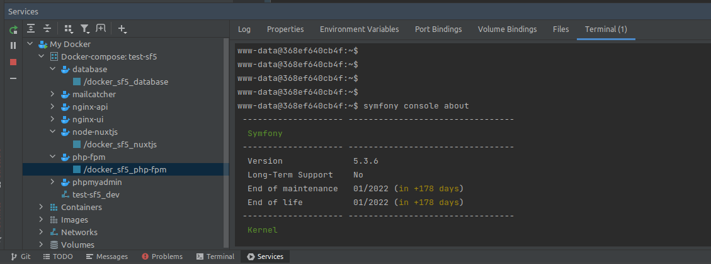

# PhpStorm

## Introduction

PHPStorm de JetBrains avec son plugin Symfony, (sponsorisé par SensioLabs et validé par Jetbrains) est l’un des meilleurs IDE du marché en termes d’utilisabilité et d’analyse temps réel de la qualité du code. 

De plus, son support très complet de l’autocomplétion (y compris des noms des services) et des commandes pour Symfony et Composer le rendent très agréable et performant à utiliser.

Il dispose également d’un excellent support de JavaScript (WebStorm) pour le développement des clients de l'API.
Son utilisation permet d’augmenter la productivité des développeurs et de s’assurer (si les recommandations de l’IDE sont suivies par les développeurs) d’une qualité correcte du code.

## Installation

Télécharger et suivre les instructions sur le site de [Jet Brains](https://www.jetbrains.com/phpstorm/download/#section=linux).

## Configuration

### Langues
Dans File / Settings, rubrique Editor / Proofreading, il est intéressant d'ajouter le Français dans la liste des langues reconnues par l'IDE -)

### Plugins
Dans File / Settings, rubrique Plugins, installer le plugin Symfony.

### GitHub
Pour l'accès distant à Github, il faut configurer un compte utilisateur dans File / Settings, rubrique Version Control / Github.

## Docker / NodeJS

Using Node.js with Docker in PHP Storm requires some configuration: 

- check that the Docker plugin is installed and enabled
- check that the Node.js remote interpreter plugin is installed and enabled
- read some doc -) 

Configure Docker in PHP Storm: 

Connect to the Docker daemon and see what's going on (check the **Services** tab): 

**[Nice to have]** Configure the remote Docker Node.js interpreter (in the Run/Debug configurations):

Remote Node.js interpreter for PHP Storm, [here](https://blog.jetbrains.com/webstorm/2017/04/quick-tour-of-webstorm-and-docker/). 

**Note** that this will not fix the missing Node interpreter for ESLint ([see this IntelliJ issue](https://youtrack.jetbrains.com/issue/WEB-20824?_ga=2.45844580.1561197932.1583390850-162746222.1583390850))

More information about Node.js and PHP Storm [on this page](https://www.jetbrains.com/help/webstorm/developing-node-js-applications.html).
