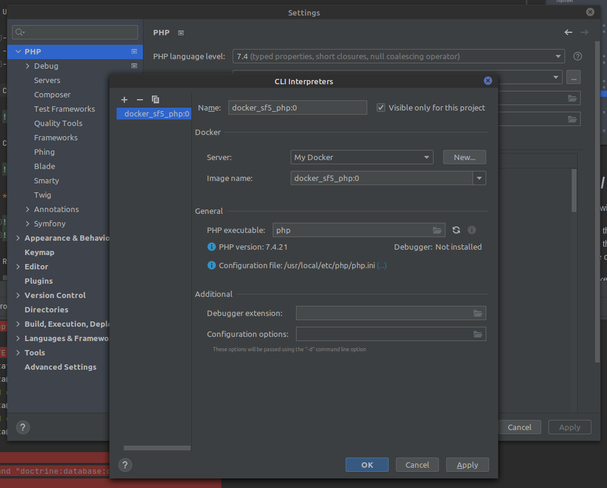
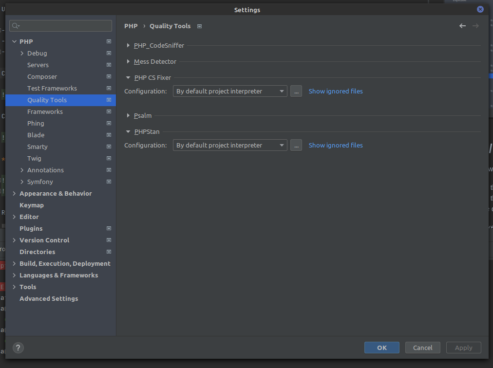
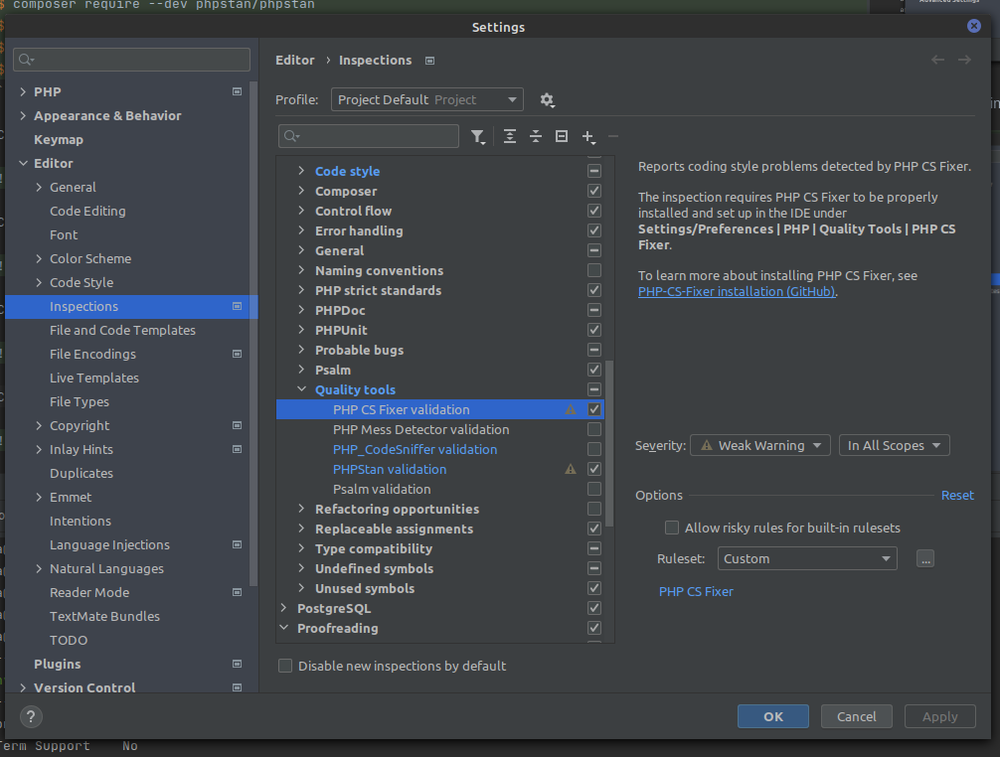
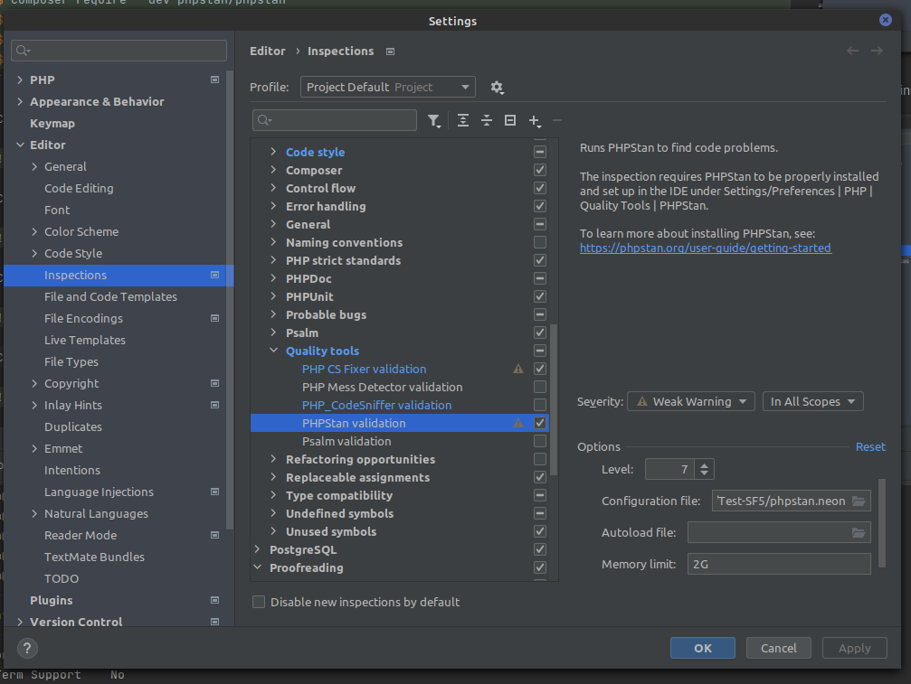

# PhpStorm

## Introduction

PHPStorm de JetBrains avec son plugin Symfony, (sponsorisé par SensioLabs et validé par Jetbrains) est l’un des meilleurs IDE du marché en termes d’utilisabilité et d’analyse temps réel de la qualité du code. 

De plus, son support très complet de l’autocomplétion (y compris des noms des services) et des commandes pour Symfony et Composer le rendent très agréable et performant à utiliser.

Il dispose également d’un excellent support de JavaScript (WebStorm) pour le développement des clients de l'API.
Son utilisation permet d’augmenter la productivité des développeurs et de s’assurer (si les recommandations de l’IDE sont suivies par les développeurs) d’une qualité correcte du code.

## Installation

Télécharger et suivre les instructions sur le site de [Jet Brains](https://www.jetbrains.com/phpstorm/download/#section=linux).

## Configuration

### Langues
Dans `File / Settings`, rubrique `Editor / Proofreading`, il est intéressant d'ajouter le Français dans la liste des langues reconnues par l'IDE -)

### Plugins
Dans `File / Settings`, rubrique `Plugins`, installer le plugin Symfony.

### GitHub
Pour l'accès distant à Github, il faut configurer un compte utilisateur dans File / Settings, rubrique Version Control / Github.

Voir dans [ce doc](./dev_setup.md) pour l'utilisation d'une clef SSH avec Github.

**Note** : PHP Storm permet de gérer les Pull Request et de faire les review de PR depuis l'IDE ! 


## Docker / NodeJS

Pour utiliser Node.js avec Docker dans PHP Storm :

- le plugin Docker est installé et actif
- idem pour le plugin Remote Node.js 
- un interpréteur Node.js en mode *remote* est configuré 
- lire de la doc : Remote Node.js interpreter for PHP Storm, [here](https://blog.jetbrains.com/webstorm/2017/04/quick-tour-of-webstorm-and-docker/).

Configurer Docker dans PHP Storm : 


Connection au daemon Docker daemon (onglet **Services**): 


**[Nice to have]** Configurer un Node.js remote dans Docker Node.js (Run/Debug configurations) :


**Note** that this will not fix the missing Node interpreter for ESLint ([see this IntelliJ issue](https://youtrack.jetbrains.com/issue/WEB-20824?_ga=2.45844580.1561197932.1583390850-162746222.1583390850))

Plus d'information pour Node.js et PHP Storm [sur cette page](https://www.jetbrains.com/help/webstorm/developing-node-js-applications.html).

## Docker / PHP Quality tools

Configurer les quality tools de PHP dans PHP Storm permet d'avoir l'inspection de code source pendant l'édition plutôt que d'attendre l'exécution d'un pipeline de CI/CD.

Il faut, au préalable, avoir installé PHP CS fixer et PHPStan (plus d'information [dans ce doc](./dev_rules.md) dans le container qui exécute PHP :

```shell
$ composer require --dev friendsofphp/php-cs-fixer

# Install the application and a Symfony extension
$ composer require --dev phpstan/phpstan
$ composer require --dev phpstan/extension-installer
$ composer require --dev phpstan/phpstan-doctrine
$ composer require --dev phpstan/phpstan-symfony
```

Configurer Docker dans PHP Storm :


Configurer un interpréteur PHP remote dans Docker :



Configurer les PHP quality tools pour utiliser cet interpréteur :



Configurer les inspections PHP :
- PHP Cs fixer utilise [ce fichier de configuration (.php-cs-fixer.dist.php)](../.php-cs-fixer.dist.php).


- PHP Stan utilise [ce fichier de configuration (phpstan.neon)](../phpstan.neon).

- 

